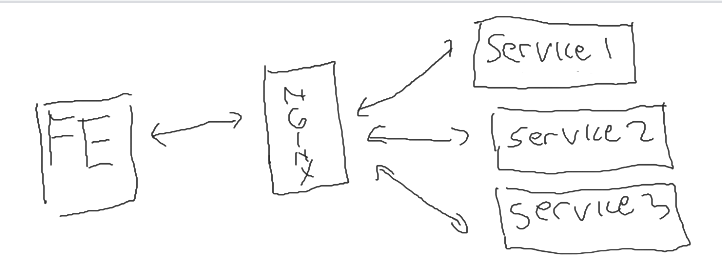

# docker-soa

# When do you need this
Suppose that you work in a team working on server-side services, and each team member works in silo.  One day, you decide to hire a frontend engineer. Then, the server-side services need to be integrated into something like the following.



You could easily containerize each server and use the Nginx (also containeraize) as a reverse proxy server.

# Installation

Depending on your server address and port number being expose, you could, for example, do the following.

```
bash install.sh -s localhost -p 8000
```

# How to run

Go to [http://localhost:8000](http://localhost:8000)

# Requirements

- Docker
- Docker-compose

# Contributors
- Ardimas Andi Purwita (ardimas.purwita@binus.edu)
